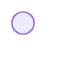
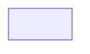

## What are user flows?

    User flows represent the steps a user takes within a digital interface. They describe the path from entering a page or application to a final action, such as making a purchase or filling out a form.
    These diagrams are used to understand, design, and optimize the user experience. 
    The main objective of a user flow is to improve the user experience. It allows teams to design simple, logical, and efficient interfaces.

## Geometric shapes and their uses

<table>
  <tr>
    <td>
      

</td>
    <td>
      <strong>Circle (Start/End)</strong> 
      Indicates the user's entry point to the site or the final confirmation of their order.
    </td>
  </tr>
  <tr>
    <td>

</td>
    <td>
      <strong>Diamond (Decision)</strong> 
      This represents a crucial choice, such as accepting customization or choosing a rendering mode.
    </td>
  </tr>
  <tr>
    <td>

</td>
    <td>
      <strong>Rectangle (Step)</strong> 
      Refers to the pages or steps that users see and will go through during an experience.
    </td>
  </tr>
 <tr>
    <td>

</td>
    <td>
      <strong>Parallelogram (Data Input/cached feeds)</strong> 
      Used for user input actions that occur in the background. The idea is to show what the user doesn't necessarily see.
    </td>
  </tr>
</table>

## Macro-Flow

    The Flow macro, or "Happy Path," is the overall view of the website. It refers to the ideal and default scenario of a software process where everything runs as planned, without exceptional conditions, errors, or obstacles.  
    <strong>SIMPLE EXPLANATION OF FLOW</strong>  
    The user goes directly to the homepage and then to the service section where the product catalog is located. After selecting a model, they can customize it. The next step is to verify their login. If the user is logged in, the product will be added to their cart and payment will be processed. If the user is not logged in, they will need to log in to proceed to the following steps.

